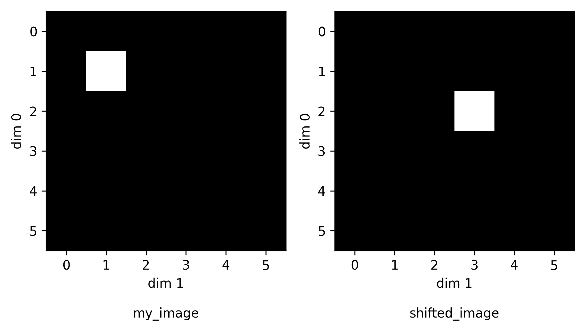

# torch-phase-shift

[](https://github.com/alisterburt/torch-phase-shift/raw/main/LICENSE)
[](https://pypi.org/project/torch-phase-shift)
[](https://python.org)
[](https://github.com/alisterburt/torch-phase-shift/actions/workflows/ci.yml)
[](https://codecov.io/gh/alisterburt/torch-phase-shift)

*torch-fourier-shift* is a package for shifting 1D, 2D and 3D images with subpixel precision 
by applying phase shifts to Fourier transforms in PyTorch.

<p align="center" width="100%">
  
</p>

```python
import torch
from torch_fourier_shift import fourier_shift_image_2d

# create a dummy image
my_image = torch.tensor(
    [[0, 0, 0, 0, 0, 0],
     [0, 1, 0, 0, 0, 0],
     [0, 0, 0, 0, 0, 0],
     [0, 0, 0, 0, 0, 0],
     [0, 0, 0, 0, 0, 0],
     [0, 0, 0, 0, 0, 0]]
)

# shift the image by 1 pixel in dim 0, 2 pixels in dim 1
shifted_image = fourier_shift_image_2d(image=my_image, shifts=torch.tensor([1, 2]))
```

API's are equivalent for 1D and 3D images.

## Installation

*torch-fourier-shift* is available on PyPI.

```shell
pip install torch-fourier-shift
```

## Usage

Please check the the docs at [teamtomo.org/torch-fourier-shift](https://teamtomo.org/torch-fourier-shift/)


